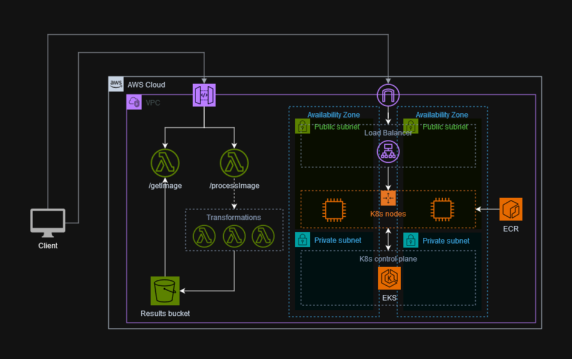

<!-- Improved compatibility of back to top link: See: https://github.com/othneildrew/Best-README-Template/pull/73 -->
<a name="readme-top"></a>


<!-- ABOUT THE PROJECT -->
## Vividarts

VividArt Studios is at a pivotal moment in its photography journey, acknowledging challenges in current photo editing tools, particularly during the photo upload phase. The need for seamless transformations has led the studio to seek innovative solutions that align with its growth. Recognizing the importance of exceeding client expectations, the studio emphasizes the necessity for a robust system to enhance the editing experience and ensure a smooth workflow. The scalability of the current infrastructure is a focus, with occasional performance hiccups hindering consistent, high-quality services. VividArt Studios invites contributors to join in creating a modern system that anticipates future needs, emphasizing collaboration and innovation to shape the studio's success.

Goals:
- Containerization: Seamless deployment of applications across different environments using containerization
- Automated Photo Editing Workflow: Automated workflow for photo editing that enhances the efficiency of the editing tools with serverless functions triggered by photo uploads.
- Cloud Storage for Accessibility: Cloud storage solutions, to store and manage photos.
- User-Friendly Interfaces: Intuitive and user-friendly interfaces for both photographers and clients.
- Infrastructure as Code (IaC): Infrastructure as Code to automate the provisioning and management of infrastructure resources.
- Monitoring and Analytics: Gather insights for continuous improvement
- Continuous Integration/Continuous Deployment (CI/CD): CI/CD pipelines to automate the testing and deployment of changes, ensuring a rapid and reliable release cycle.

### Collaborations
This is a hand-on cloud engineering project delivered by the Azubi Africa Group 4 team in 2023. After 6 months of AWS cloud training and front-end development, we got a chance to work on some realife cloud projects. 
The team members were:
 1. Emmanuel Akolbire [Linkedin](https://www.linkedin.com/in/emmanuel-akolbire)
 2. Prince Adama Aryee
 3. Joseph Nsiah
 4. Jerono  Bargotio
 5. Ogbomo Festus
 6. Segla Gislain
 7. Temesgen Teshome

## Project Overview
#### Technologies
- Python 3.10
- Flask
- Pillow
- Docker
- Kubernetes
- Terraform
- AWS

#### Application
The application is a web page served by a Flask webserver running in a Kubernetes cluster behind a load balancer. The application sends to requests to the API to process an image and polls for the result.

#### API
The API served by an AWS API gateway which routes requests to AWS lambda functions which invoke transformer functions to process and save the image in an S3 bucket for retrieval

### The Architecture
<a href="https://github.com/DeXtreme/Vividarts">
    
</a>

<p align="right">(<a href="#readme-top">back to top</a>)</p>

### Installation
1. Clone the repo
```sh
   git clone https://github.com/your_username_/Project-Name.git
```
2. Create the lambda function packages
```sh
cd src/api/getImage && zip getImage.zip ./*
cd ../processImage && zip processImage.zip ./*
cd ../Greyscale/ && pip install -r requirements.txt -t ./ && zip -r Greyscale.zip ./*
```
3. Navigate to the `terraform` folder
```sh
cd src/terraform
```
4. Initialize terraform
```sh
terraform init
```
5. Apply the terraform files. Enter the variable values when asked or create a `terraform.tfvars` file
```sh
terraform apply
```
6. Build and push the app image
```sh
export ECR_URL=$(terraform output -raw ecr_url)
export REGION=$(terraform output -raw region)
export VERSION=$(cat ../app/version.txt)
docker build -t $ECR_URL:$VERSION src/app
aws ecr get-login-password --region $REGION | docker login \
--username AWS \
--password-stdin $ECR_URL
docker push $ECR_URL:$VERSION
```
7. Deploy the app to the Kubernetes cluster
```sh
export API_URL=$(terraform output -raw api_url)
export NAME=$(terraform output -raw eks_cluster_name)
export IMAGE="$ECR_URL:$VERSION"
export ENV=staging
aws eks update-kubeconfig --region $REGION --name $NAME
cat src/app/deployment.yaml | envsubst | kubectl apply -f -
```

<p align="right">(<a href="#readme-top">back to top</a>)</p>

